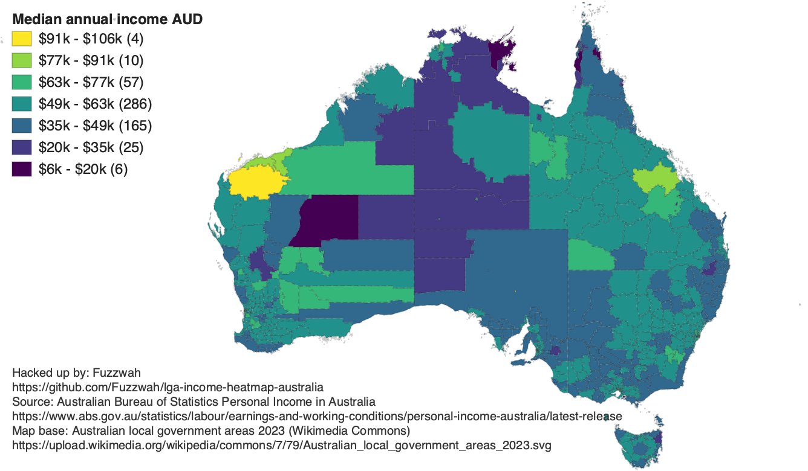

# LGA Median Income Heatmap (Australia)

Generate an SVG choropleth of Australian local government areas (LGAs) coloured
by median personal income. The project combines ABS earnings data with an LGA
boundary map to produce a shareable visual and a machine-readable mapping file.

> Note: Generated artifacts (SVG/PNG/JSON) are not checked into this repository. Run the generator locally whenever you need fresh outputs.



## Features
- Parses the ABS "Personal Income in Australia" extract, tolerating uneven
  headers and missing values.
- Matches LGAs primarily by code, with automatic fallbacks for renamed codes
  (e.g. Merri-bek) and fuzzy name matching when metadata is incomplete.
- Colours regions using a Viridis ramp, linear income buckets, and ordered
  legend from highest to lowest.
- Annotates the SVG with hover tooltips, accessible metadata, and a white
  background for consistent rendering.
- Exports both the styled SVG map and a JSON artifact describing colour bins,
  per-LGA medians, unmatched regions, and source provenance.

## Requirements
- Python 3.11+
- System packages for building Python wheels (e.g. `build-essential` on Linux).
- Python dependencies listed in `requirements.txt` (install with `pip`).

## Setup
1. Create and activate a virtual environment (optional but recommended):
   ```bash
   python3 -m venv .venv
   source .venv/bin/activate
   ```
2. Install dependencies:
   ```bash
   pip install -r requirements.txt
   ```
3. Ensure the ABS extract `abs_lga_earnings.txt` is present in the project root.
   The file should match the format provided in the latest ABS release.
4. (Optional) Place `Australian_local_government_areas_2023.svg` alongside the
   script to avoid downloading the base map at runtime.

## Usage
Run the generator with the default inputs:
```bash
python main.py
```

Useful arguments:
- `--svg-url`: Path or URL to the LGA boundary SVG (defaults to the local file,
  falling back to the Wikimedia URL if absent).
- `--input`: Path to the ABS earnings text extract.
- `--out-svg`: Output path for the rendered choropleth.
- `--out-json`: Output path for the JSON mapping report.

## Outputs
- `australia_lga_median_income_heatmap.svg`: Choropleth with legend, tooltip
  script, and source caption. Generate locally; the file is intentionally
  excluded from git history to keep the repository lightweight.
- `australia_lga_median_income_heatmap.png`: Raster export of the SVG for easy
  embedding in Markdown and other contexts that prefer images over inline SVG.
  Like the SVG, regenerate this locally before sharing.
- `lga_median_income_mapping.json`: Companion data export containing summary
  statistics, bin definitions, per-LGA colour assignments, unmatched shapes,
  and recorded source URLs.

## Data Sources
- ABS Personal Income in Australia:
  https://www.abs.gov.au/statistics/labour/earnings-and-working-conditions/personal-income-australia/latest-release#data-downloads
- Australian LGA boundaries (2023, Wikimedia Commons):
  https://upload.wikimedia.org/wikipedia/commons/7/79/Australian_local_government_areas_2023.svg

## Troubleshooting
- If the script cannot parse the ABS extract, confirm the file has not been
  altered from the original download and retains its tab-separated structure.
- If the output SVG shows uncoloured regions, inspect the JSON report for the
  `unmatched` list and update `CODE_ALIASES`, `NAME_OVERRIDES`, or
  `ELEMENT_CODE_OVERRIDES` in `main.py` as needed.
- For noticeably flat colour scales, verify the income column contains annual
  figures and rerun the script to regenerate bucket thresholds.
